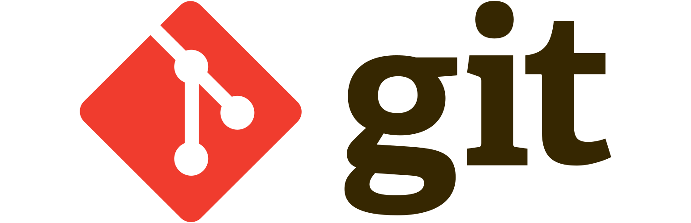

# Installing WPIlib VScode and the Java Development Kit
Before you get started with any development, you'll need to install the required tools and dependancies

## WPIlib

WPIlib is a high-level library that allows teams to focus on robot strategy and writing game specific logic instead of getting bogged down with low-level hardware control. WPIlib offers convienent classes and methods for controlling hardware like motor controllers, sensors, and robot communication. These classes abstract away the need to use complex communcation protocals to interact with hardware.

The offical WPIlib development environment comes with
* A custom Java Development Kit
* A custom instance of VScode that comes with preinstall extensions and commands to assist with FRC software development. 
 
The dev env can be installed by following [***THIS GUIDE***](https://docs.wpilib.org/en/stable/docs/zero-to-robot/step-2/wpilib-setup.html) in their documentation. 

## The Java Development Kit

The Java Development Kit (JDK) is a specialized development environment that provides tools, libraries, and runtime environments that are necessary to develop, compile, debug, and execute Java apps. Even though WPIlib comes with it's own instance of JDK, you may want to install a normal version for your convience. We recomend using the Temurin® JDK at https://adoptium.net/temurin/releases. Install the latest version for your operating system, then restart your computer.

## Git

Git is a version management tool that allows for easy collaboration and version control. There are many ways you can interact with git, but it's recommended that you use the CLI as it's extremely verstile. You can install Git from https://git-scm.com/.

---
---
#### [Home Page](../README.md) | [Next In Tools: A Guide to File Systems and the CLI](fs_cli.md)